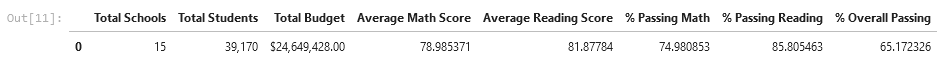
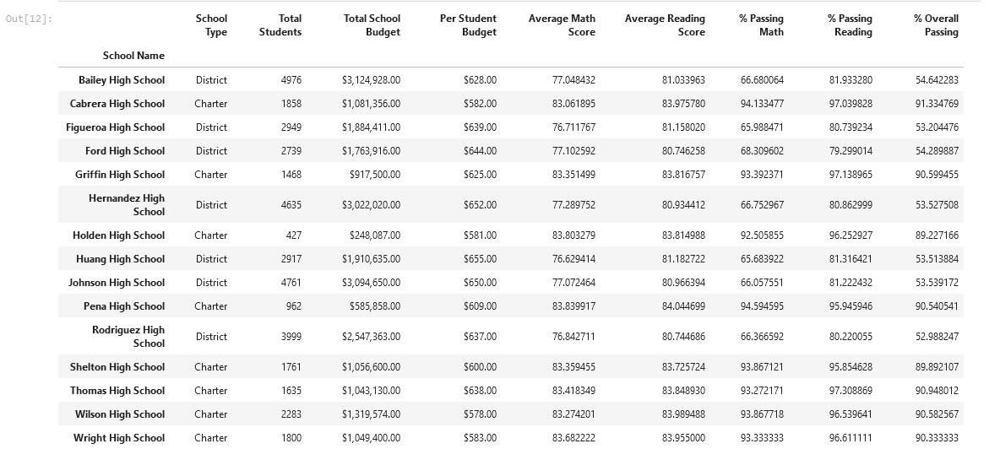
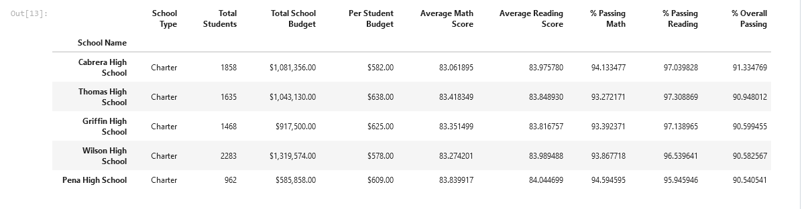
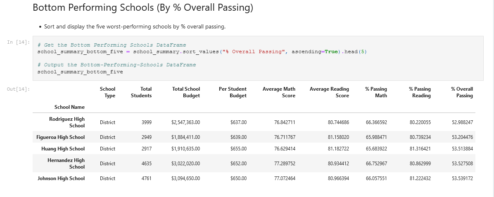
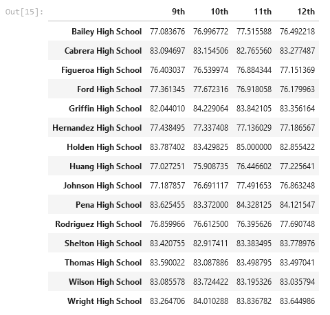
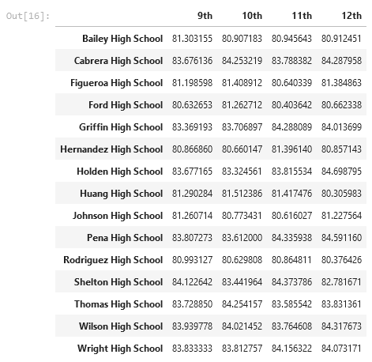
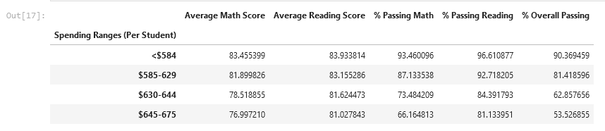
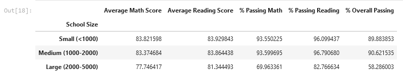
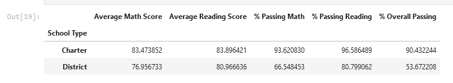

# School District Analysis

## Overview of the Project
This respository contains a [jupyter notebook script](PyCitySchools/PyCitySchools_James-Akerman.ipynb) which uses to pandas to analyse data from a hypothetical school district in order to help a school board and mayor make strategic decisions regarding future school budgets and priorities.

The report includes a list of trends found in the data as well as the following tables:
#### District Summary

 

#### School Summary

 

#### Top Performing Schools (By % Overall Passing)

 

#### Bottom Performing Schools (By % Overall Passing)

 

#### Math Scores by Grade

 

#### Reading Scores by Grade

 

#### Scores by School Spending

 

#### Scores by School Size

 

#### Scores by School Type

## Tools/Packages
- Python
  - Pandas

## How to use
- Download the repository
- Open Git Bash and type `jupyter notebook`
- Go to the **PyCitySchools** folder and open the [jupyter notebook script](PyCitySchools/PyCitySchools_James-Akerman.ipynb).
